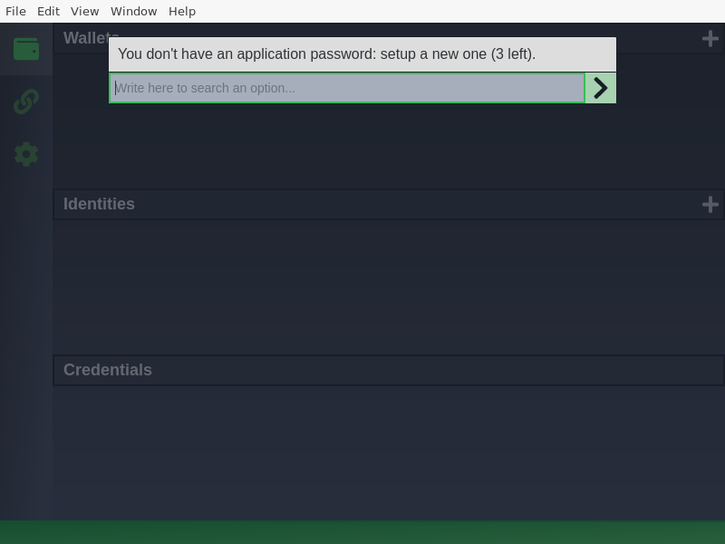
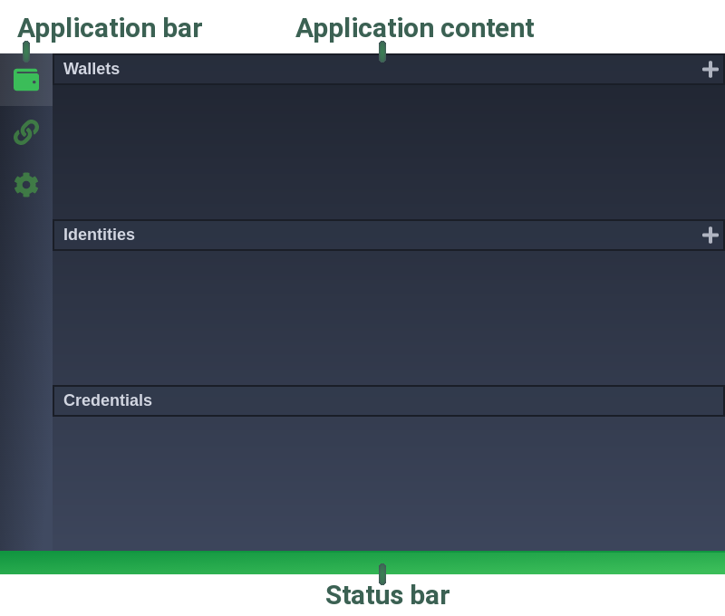
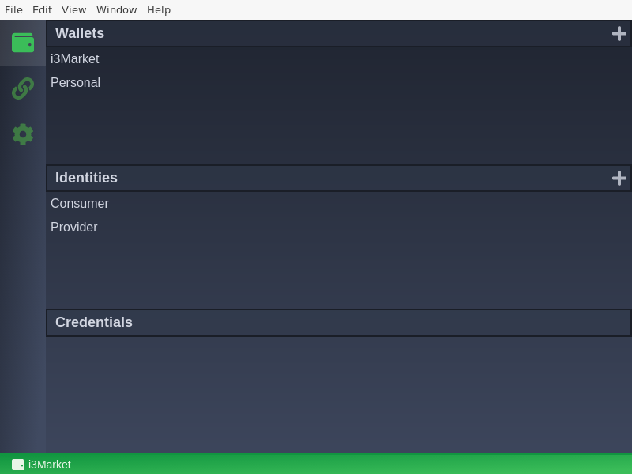
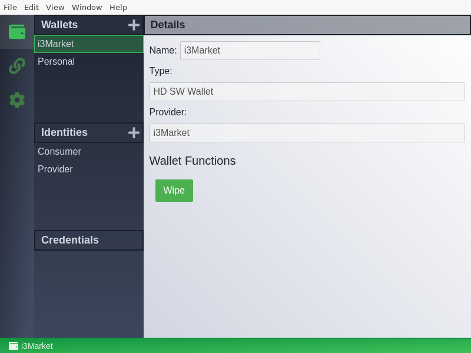
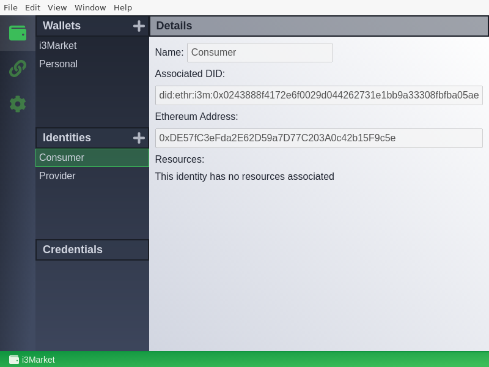
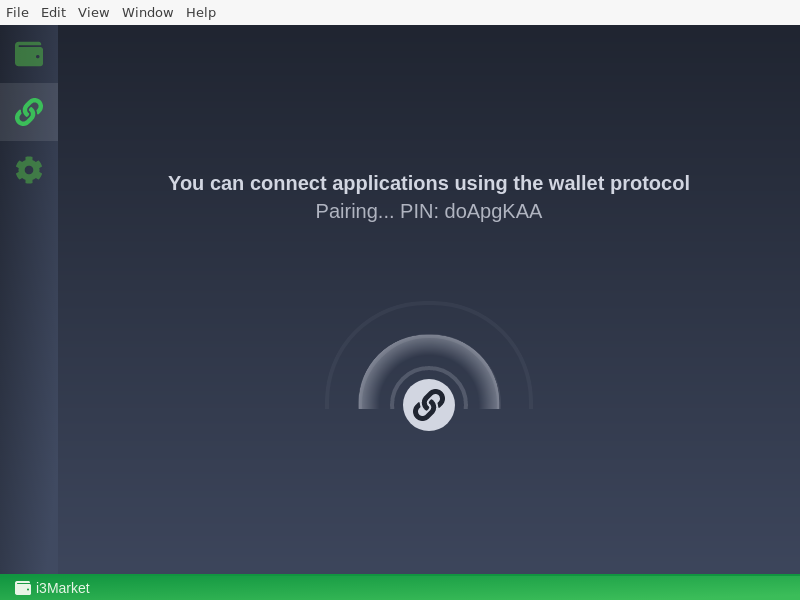
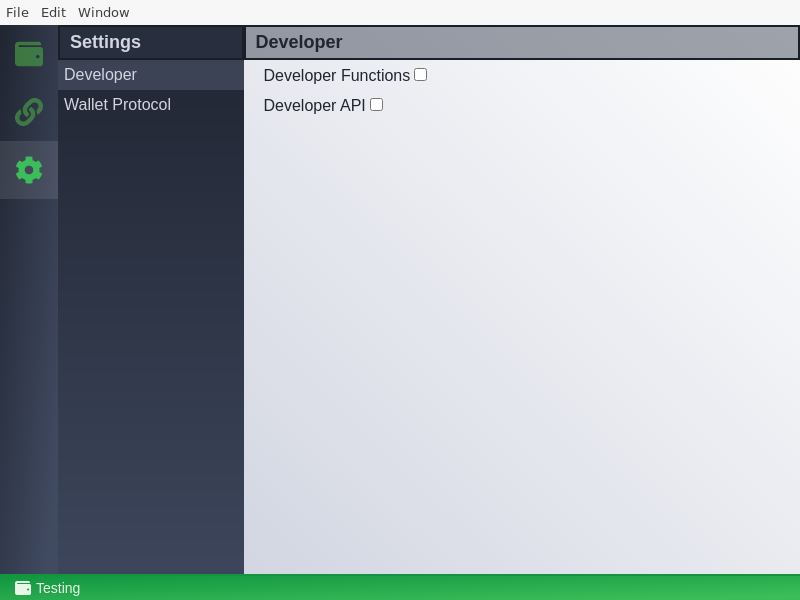

# i3M-Wallet Desktop App

The i3M-Wallet Desktop app is a desktop application (Windows, macOS, and Linux) thought to be operated by end users. The app ca be securely paired to any application, allowing the application to interact with the wallet through an HTTP API. Wallet actions requested by any application will require explicit confirmation of the end-user through the app interface (window).

## Installation

Download the [latest release](https://github.com/i3-Market-V2-Public-Repository/SP3-SCGBSSW-I3mWalletMonorepo/releases/latest).

- Windows users should download and execute the `.exe` file to install the Wallet desktop app
- MacOS users should use the `.dmg`
- Linux users can install the `.deb` file (compiled in Ubuntu 22.04 but should work in other debian-based distributions) or, preferably, just download and run the standalone `.Appimage`, which should work in any distribution.

## Usage

In this section we explain how to use the wallet desktop application.

### Initial set up

The first time a user initiates the application, a dialog asking for a password appears. The user will have to introduce this password each time the application starts.

### User Interface

The user interface (UI) is divided in three main elements: *Application Bar*, *Application content* and *Status bar*.

The *Application bar* contains three applications: *Explorer*, *Pairing* and *Settings*. The *Application content* will change depending on the selected application. Finally, the *Status bar* shows information of the state of the wallet, for instance, the current wallet selected.

#### Explorer

The explorer application lets users manage their wallets, identities and credentials.

Wallets are sets of identities and credentials. When you create a wallet you can specify its type and the network where they are connected. Wallets can be **HD SW Wallets**, which means that the keys are generated using a mnemonic. Storing this mnemonic users can recover all the keys. Wallets can also be **Bag of keys**, which lets users import specific keys.

Users can also manage their identities. They are identifiers (DIDs) where users can link attributes to complement this information, for instance, claiming that they are valid consumers. Those attributes are called verifiable credentials, or just credentials.

#### Pairing

Several applications from i3-market may require the use of your wallet. To securely use it, you should ´pair' them to your wallet using the [wallet protocol](../wallet-protocol/README.md).

To proceed with the pairing, you should put your wallet in pairing mode. Just open the wallet protocol app and click the pairing button, the wallet will temporarily show a PIN in the screen:

To finish the pairing, you should manually type this PIN in the JS application. Follow the [`@i3m/wallet-protocol` documentation](../wallet-protocol/README.md) and/or the [pairing example documentation](../wallet-protocol/src/docs/example/initiator-example.md) to learn how to easily pair you JS application (either browser or node.js) to your wallet.

> [ONLY FOR DEVELOPERS] You can generate a session token using the test pairing application built in the developer API. For more information got to [Settings](#settings). 

#### Settings

The **Settings** application lets users configure the application settings. The only settings available for the current version are very development specific, so our recommendation is to leave them disabled for common users.

- **Developer**
  - **Developer Functions**: shows wallet developer functions. To access these functions go to the explorer app and select a wallet. In the details view, you will have now a new set of functions called developer functions.
  - **Developer API**: enables the developer API. There are two applications.
    - OpenAPI browsable spec at <http://localhost:29170/api-spec/ui>
    - Pairing form at <http://localhost:29170/pairing>
- **Wallet Protocol**
  - **Enable token expiration**: for security reasons, the sessions for the wallet protocol have a limited time to life. By unselecting this option, session will last forever. This is useful for developing purposes and should never be enabled in a real environment.
  - **Wallet protocol session TTL**: seconds that a wallet protocol session last. If the token expiration is not enabled this option is ignored.
