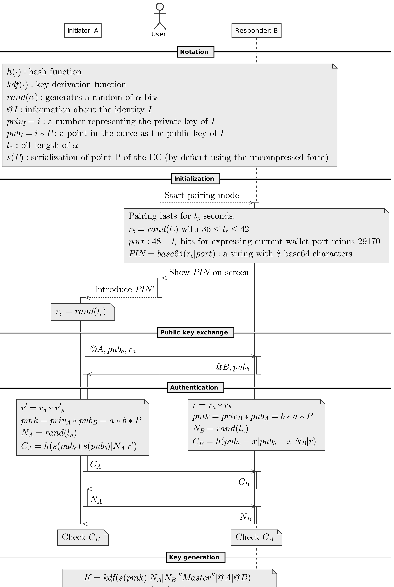

[](LICENSE)
[](CODE_OF_CONDUCT.md)
[](https://standardjs.com)

# @i3m/wallet-protocol

The implementation of a protocol that can securely connect the i3M Wallet with another application.

The protocol is based on the Bluetooth pairing. To create a secure channel, the user must set the wallet in pairing mode. Then, the wallet will show an 8-digit PIN on the screen. This PIN is composed by the TCP port and the authentication data. When the user introduces the PIN into the browser, it will initiate a direct communication with the wallet performing a mutual authentication and finally creating a secure channel.


## Diagram

The complete wallet protocol sequence diagram is the following:



## Libraries

There are 3 libraries related with the wallet protocol.

| **Name**              | **Package**                  | **Description**                                                                                                      |
|-----------------------|------------------------------|----------------------------------------------------------------------------------------------------------------------|
| Wallet Protocol       | `@i3m/wallet-protocol`       | Main implementation of the wallet protocol                                                                           |
| Wallet Protocol Utils | `@i3m/wallet-protocol-utils` | Utilities to execute the protocol. It includes:   - A modal to introduce the PIN   - A local storage session manager |
| Wallet Protocol API   | `@i3m/wallet-protocol-api`   | A library that uses a wallet protocol session to call the wallet-desktop-openapi                                     |

### @i3m/wallet-protocol

Create a session with a wallet:

```typescript
import { HttpInitiatorTransport, WalletProtocol } from '@i3m/wallet-protocol'

// openModal is a function that returns a Promise<string> that resolves to the PIN
async function main(): Promise<string> {
    const transport = new HttpInitiatorTransport({ getConnectionString: openModal })
    const protocol = new WalletProtocol(transport)
    const session = await protocol.run()
}
```

### @i3m/wallet-protocol-utils

Open modal function:

```typescript
import { openModal } from '@i3m/wallet-protocol-utils'

const { openModal, LocalSessionManager } = walletProtocolUtils
```

Create a session with the session manager:

```typescript
import { LocalSessionManager } from '@i3m/wallet-protocol-utils'

const sessionManager = new LocalSessionManager(protocol)

sessionManager
  .$session
  .subscribe((session) => {
    // This callback is executed each time the session changes
    sessionState.innerText = session !== undefined ? 'ON' : 'OFF'
  })

await sessionManager.createIfNotExists()
```

### @i3m/wallet-protocol-api

Create an API object and call it:

```typescript
import { WalletApi } from '@i3m/wallet-protocol-api'

const api = new WalletApi(session)

// Now you can execute any method
api.identities.list()
api.identities.select()
api.identities.create()

// All the methods are described on the @i3m/wallet-desktop-openapi specification.
```

## API reference documentation

[Check the API](docs/API.md)

## Initiator example

A complete example on how to program an initiator for the wallet protocol can be found [here](docs/INITIATOR_EXAMPLE.md)